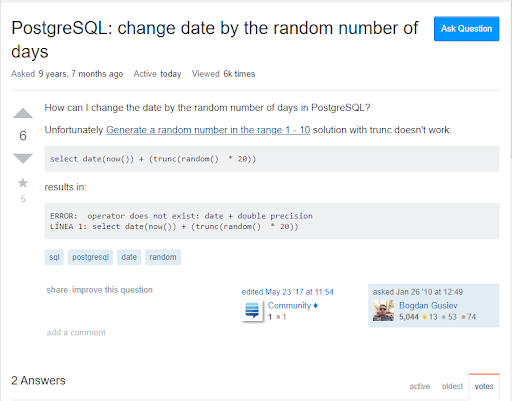
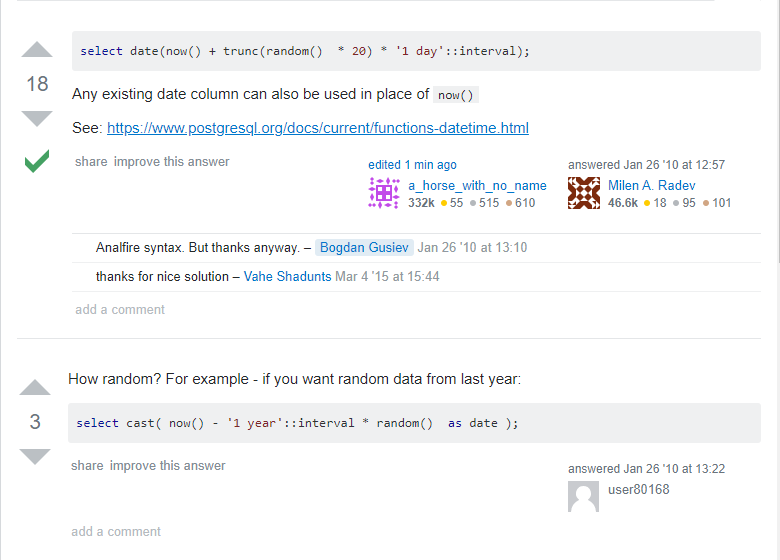
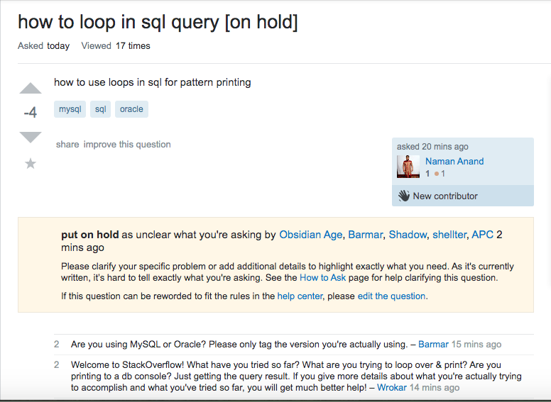

For software developers, it is vital to ask smart questions in a critical and effective way. In a site like Stack Overflow, this is a great place to effectively ask these questions with clear descriptions and understandable goals that the developer is attempting to reach. This makes the process way easier to gain insight from hackers who can assist with the issue the developer is running into in a timely and efficient matter. This saves time from playing forum-tag, similar to phone-tag with missed phone calls, that create more questions than answers. Below I have two examples, one being a smart way to a question and the other, well not so smart.

An example, from a developer that demonstrates the “smart way” to ask a question, is with this submitted question:

Here the developer clearly stated that the language they are working with is PostgreSQL and specifically what they are dealing with. This developer starts off simple, by stating their goal and then showing that they STFW (searched the *beeping* web) already by looking at a previous forum within Stack Overflow which has a similar topic to their own problem. Next, they provided the line in their code that is giving them problems, in addition to the error message he received. On top of that, this developer added some simple tags that would pop up when others are searching up answers relating to “sql”, “PostgreSQL”, or about how to use “date” and “random.” Although this posted question was a while ago, nearly a decade, this forum is still actively viewed today. With the answers to this question, they are short but highly informative. The first answer was posted 8 minutes after and provided a link to the documentation page that explains more about the topic. In the second answer by user80168, they replied in a more general approach and gave an example by changing data randomly from last year. I believe that both of these responses are insightful and the developer who asked this question made the right steps in order to let the hacker know they can STFW because we all can. Also, he referred to older forums as a reference to his query and provided the snippet of the compiler message when the error occurs. 

Next, let us take a look at a question that follows the “not smart way” to ask a question within Stack Overflow:

In this example, the developer does not give any information about what they are working with. Some of the hackers within the community took time to view the forum and downvoted the question which resulted in it being put on hold after being up for 20 minutes. I believe that this question being put on hold was the correct thing to do because there is no context on whether they were using MySQL or Oracle. This question screams out to hackers that this developer obviously did not have the time to RTFM (read the *beeping* manual). In addition, they probably did not even google their query first before coming to Stack Overflow. I searched this question within Google and the immediate top hit is from GeekforGeeks (To see the link about this possible solution, click <a href="https://www.geeksforgeeks.org/print-different-star-patterns-sql/" target="_blank">here</a>, with something that I believe the developer is looking for. It only took a few minutes to instantly find something that most likely relates to the developer’s question. When we take a look at the link in the previous sentence, I am under the impression that this developer was requesting help for a homework assignment. This could explain why he did not elaborate on what they are currently working on or provide a source that could strengthen his chances of receiving help from a hacker.

In conclusion, we saw earlier that when asking smart questions it is important to include context to your problem, set specific goals, and be clear on what the exact issue is with your program. When these criteria are achieved, chances are your question will be answered by a hacker who will be willing to help. Showing that you have made the effort of researching similar issues shows that you want to learn effectively.
