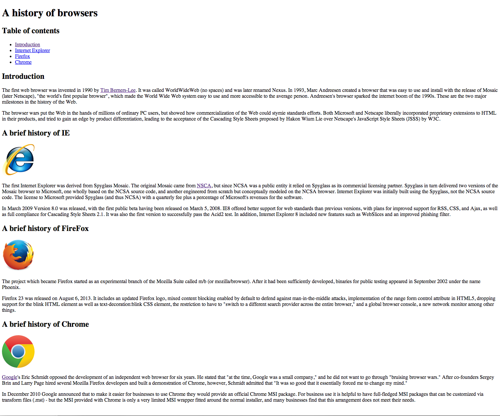
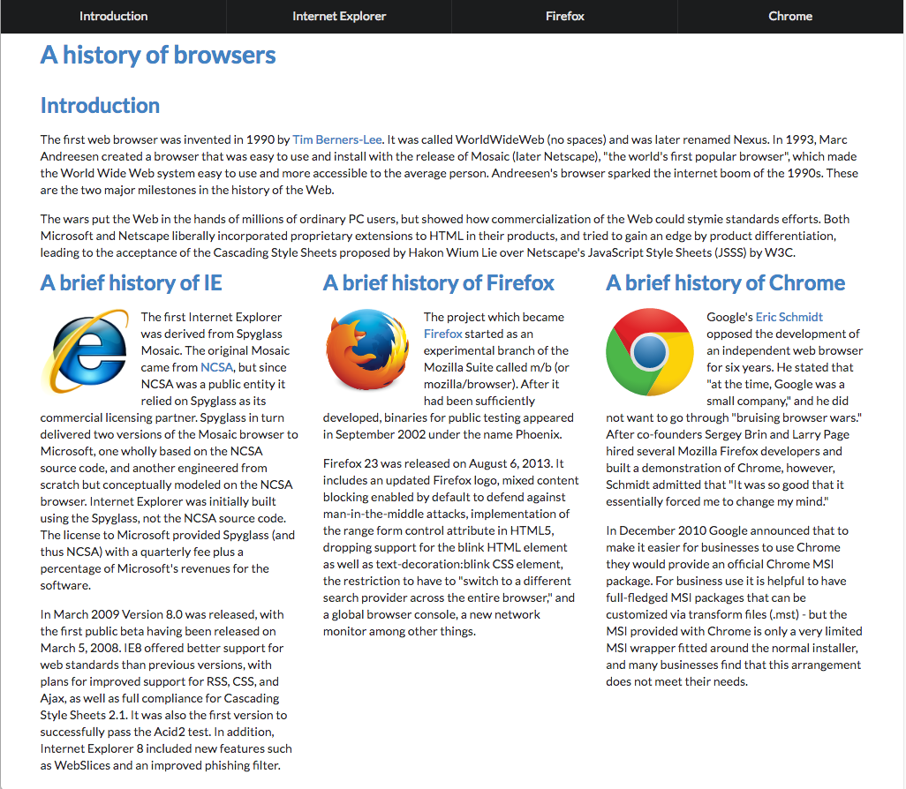

Although understanding the UI (User Interface) Framework is as complex as learning a new programming language, it does have its perks. For those who may not know <a href="https://semantic-ui.com" target="_blank">Semantic UI</a>, it is a part of the UI Framework that transforms webpages created from HTML (Hypertext Markup Language) and CSS (Cascading Style Sheet) code. Investing time and going through the hair-pulling frustration of the learning process of Semantic UI is worth it for anyone interested in Software Engineering. Utilizing semantics saves time, provides easier naming conventions, and creates visually appealing for users.

Normally when creating a webpage with just the HTML and CSS code, it can seem like a daunting task to build a menu or navigation bar with numerous tags like header, unorder list, list, or division. Often times the navigation bar can be hard to follow because there are so many components. Here is an example of raw HTML and CSS when creating a navigation bar:
  

  
Now let us implement Semantic UI to this HTML and CSS and find that it is superiorly easier to read through when looking at the code. We save a lot of lines with our code and can clearly see what we are creating which is a menu that contains a list of items inside. Usually, fewer lines of codes mean that the developer is saving time. Here is a snippet of the code that utilizes semantics:
  

  
From personal experiences with web development, I have only coded my webpages with raw HTML and CSS code with Atom. I would use the website <a href="https://www.w3schools.com" target="_blank">W3Schools</a> to get the correct layout of a webpage and CSS styles. When learning Semantic UI this past week, I found it extremely convenient to use. To be completely honest, I felt overwhelmed by the plentiful amount of usages it has to offer when first starting to learn it. However, the naming conventions for semantics are easier to remember and follow when looking back on the same code later on for modifications. At first coding with Semantic UI seems slow since everything is relatively new, but in time the pace begins to pick up when you are able to recognize which semantics will come in handy.

Lastly, I found semantics to be visually appealing for users who are casually browsing the internet. For example, if a person searches on the web for information on the “History of Browsers” which one would you rather see? 
  
Raw HTML and CSS code:
 

 
Adding Semantics UI to the raw HTML and CSS:

  
Even though both images above have the same information displayed most people would obviously choose the second webpage. Now, why is that? Well, this webpage is visually appealing, everything is organized in a neat matter and well-formatted. This means, that we (the users) are more likely to stay on their site and read their content too. For software engineers, this is what we strive to achieve when developing our own websites.

Overall, Semantic UI is helpful because it gives a raw code of HTML and CSS webpage a boost of extra style and design. I am glad that I had taken the time to look through the usages of semantics and hope that one day you will have the opportunity to try out Semantic UI for yourself.
