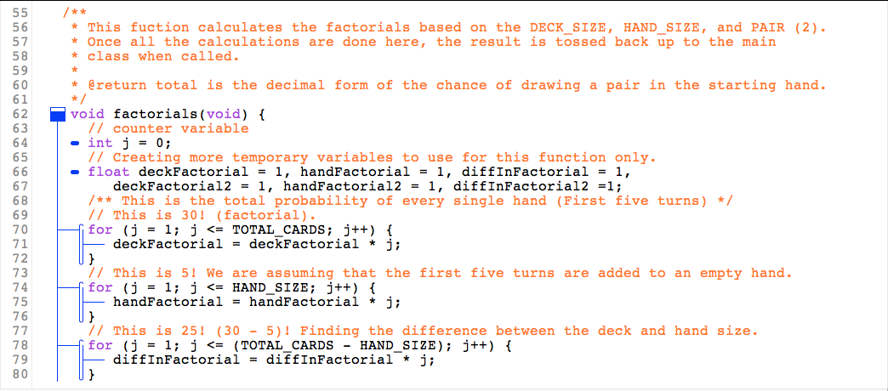
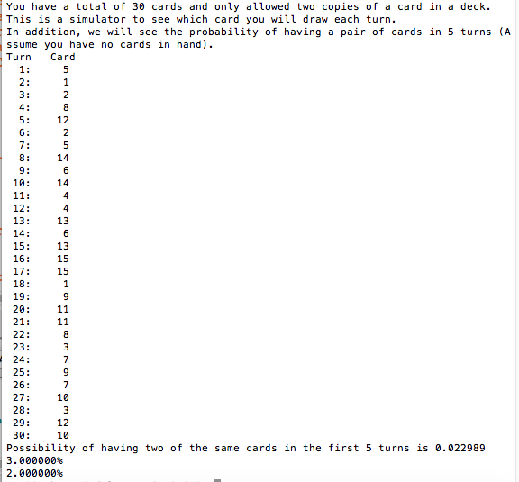

For one of my assignments in ICS 212, the class was tasked to create our own program based on what we learned in C after two weeks of the semester. At this point, we did not learn how to create arrays in C Language. Instantly I thought of making a deck tracker similar where it can display the drawing order when given a deck of cards. Most of my inspiration came from playing Hearthstone and using another application called HS Tracker. Basically, HS Tracker is a useful tool that tells you what card you just have drawn, what cards are left in your deck still, and the probability of drawing a specific card in your deck.

This program simulates the probability of drawing a pair of cards (2 of a kind) within five turns. There are 15 pairs of 2 identical cards, which makes up 30 cards in total. The program also displays the drawing order, assuming we have an empty hand. This was inspired by my one of favorite card games (Hearthstone) and to see how difficult it was to find the probability of drawing a single pair of cards. I plan to build more upon this program on the side while I learn more about C language in this course.

Below is my sample code of how I calculated the probability of drawing a single pair of cards:

Here is the results when I ran my program:

