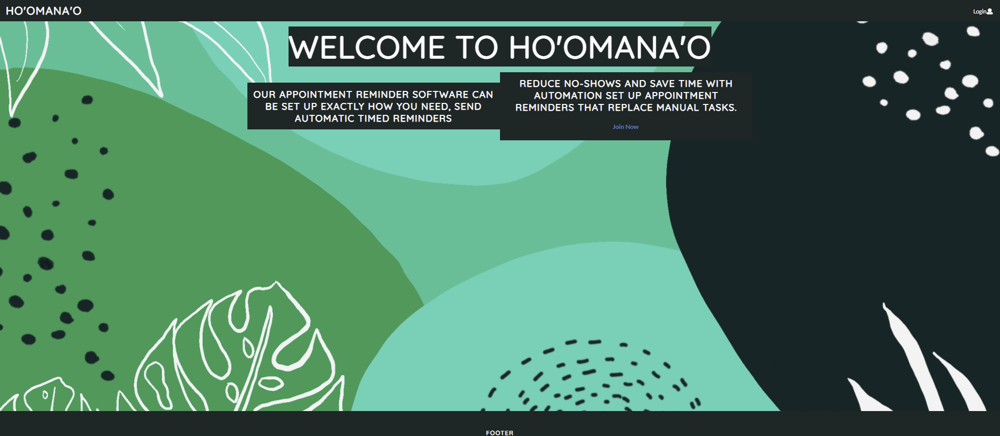
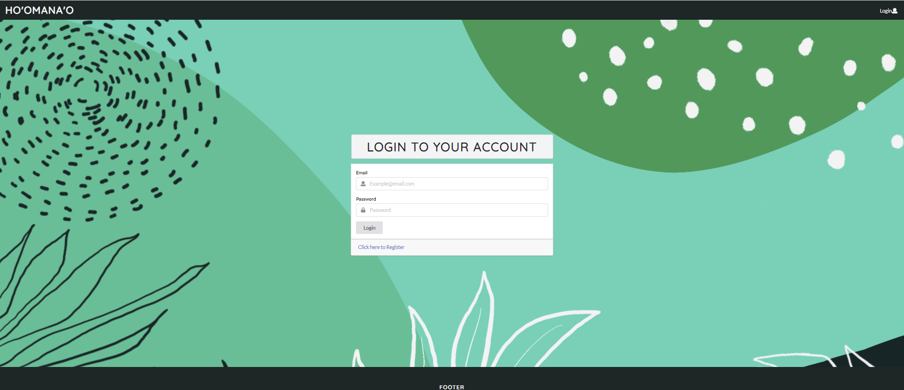

Ho'omana'o, which in Hawaiian means reminder, is an web application where users are able to add reminders for their future doctor's appointments. Through our data gathering process, we found that there was no real reliable way for patients to be reminded of their upcoming appointments. For both patients and doctors, they are both at a loss when it comes "no-shows". Patients may not be able to get their required medication for their health and well-being. At the same time, doctors as well with hospitals lose time, money, and see it as their responsibility to ensure that paitients know when the next appointment is scheduled.

For this website, our group made a login, sign-up, landing, calendar, and help page. Below are some of the pages that our group made for the Ho'omana'o Project:

  

    <h2>Landing Page</h1>
    
  

  

    <h2>Login Page</h1>
    
  

  

    <h2>Calendar Page</h1>
    
  

This project with my group members, taught me a lot about Human-Computer Interaction. The course that was taken alongside this project has taught me more about designing for the user experience and ensuring that a product is intuitive for anyone to use. I helped with the Login Page, brainstorming on the development of this webpage as well as data gathering. The repository for our web application can be found <a target="blank" href="https://github.com/Ho-omana-o/Ho-omana-o">here</a>. The website for our application is currently unavailable at this time. In addition, our final report on this project can be found <a target="blank" href="../images/Ho'omana'o_Project.pdf">here</a>.
