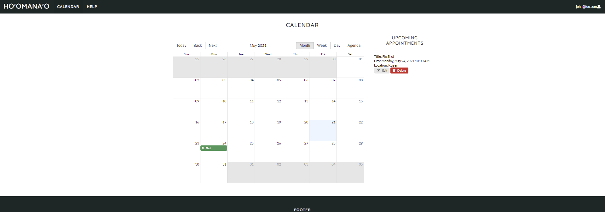

Ho'omana'o, which in Hawaiian means reminder, is an web application where users are able to add reminders for their future doctor's appointments. Through our data gathering process, we found that there were no real reliable way for paitients to be reminded of their upcoming appointments. For both paitients and doctors, they are both at a lost when it comes "no-shows". Paitients may not be able to get their required medication for their health and well-being. At the same time, doctors as well with hospitals lose time, money, and see it as their responsibility to ensure that paitients know when the next appointment is scheduled.

My group and I centered the development of this application with idea of it being user-friendly and easy-to-use...

  

    
  

  

    
  

  

    
  

  
  <a>&#10094;</a>
  <a>&#10095;</a>

This project with my group members, taught me a lot about Human Computer Interaction. I helped with the Login Page, brainstorming on the development of this webpage as well as data gathering. The repository for our web application can be found here. In addition, our final report on this project can be found here.
