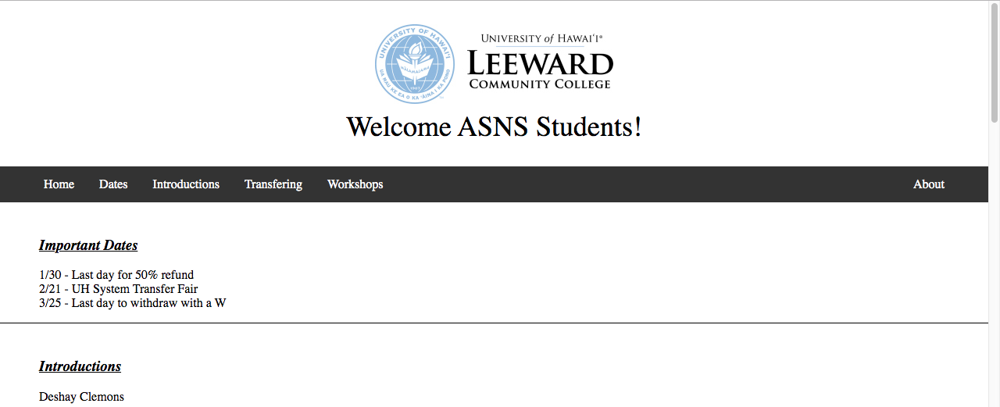
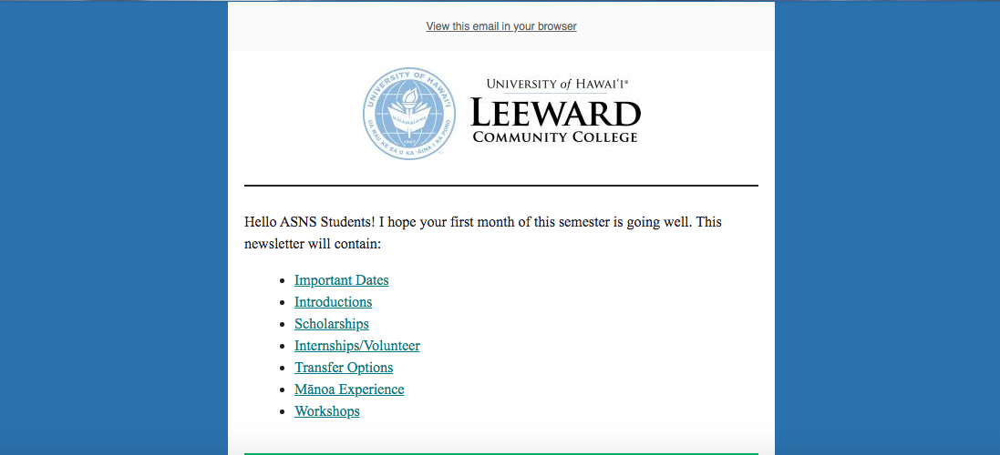

Click on the image below to see the before and after of the my webpages.

  
  

At the time, I was taking a web development class (ICS 215) where I learned multiple languages such as HTML, Python, Javascript, and more. My boss asked me to create a newsletter for all of the Leeward students and I decided to use my knowledge from ICS 215 to create a HTML page. I made this my goal to complete it by one week since I was still new to working with HTML. When I first began constructing this webpage, it was rough process. When brainstorming, I decided to first seek inspiration on what type of webpages I was drawn towards to.

In my mind, the main feature I love the most is the sticky Navbar (Navigation Bar) because it is extremely usely when browsing any page. Instead of tediously scrolling back up to a previous section of an article or the top, one click makes it so much easier. This makes it easier when browsing for something on the web, checking social media, or reading articles. Although it may take more time and inconvient to implement this feature, it makes the user's experience so much convient. Popular websites I noticed utilizing this common feature were Google, Facebook, and Hulu for example.

When it came time to submission, I hit a road block and realized that the webpage would not be so user friendly for mobile phones. With this I saw that my hard work did not go to waste, because I decided to use MailChimp. When I uploaded my HTML page into MailChimp, it only took bits and pieces due to MailChimp's syntax. So I, essentially redid the webpage and was able to learn more about creating a seemingly simple webpage to display.

This is a snippet of the Navbar I created:
'<ul>
    <li><a href="#top" active:="">Home</a></li>
    <li><a href="#dates">Dates</a></li>
    <li><a href="#intro">Introductions</a></li><li>
    </li><li><a href="#transfer">Transfering</a></li>
    <li><a href="#workshops">Workshops</a></li>
    <li style="float:right"><a href="#About">About</a></li>
  </ul>
'
