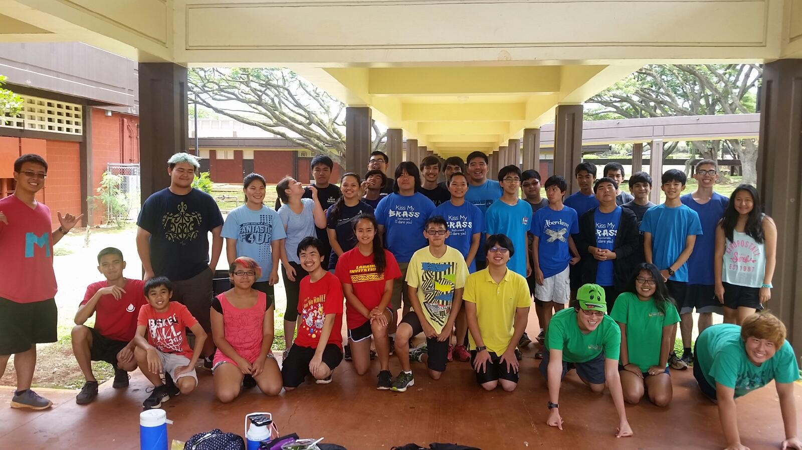

In my senior year of high school, I became a section leader for the marching band. I enjoyed being apart of the leadership team and collaborated with my fellow leaders in order to teach new members. In addition, as one of the leaders, I had to ensure everyone goes where they need to be on the field in my section. Within the low brass section, we made sure to do our part by committing to our goals and working together as a unit so we can always bring out the best in our musical capabilities.

Look back at this moment, I found that this opportunity has helped me become a better leader and person overall. Being able to listen to my section's comments and concerns while keeping an open mind of understanding. After replying with immediate feedback and constructive criticism in order to motivate my section to do their best. Now I feel that this has helped me significantly improve my people-skills with not only co-workers but customers that I have as well.  
  
